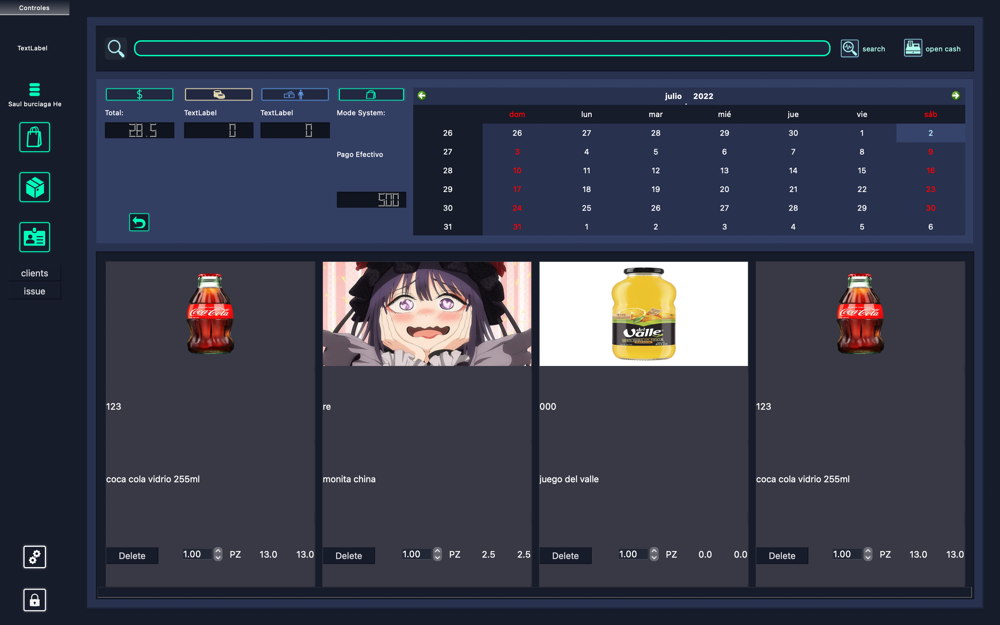

# SirreFacc Sistema Pos

<!-- PROJECT LOGO -->
 

  

## Como instalar
1. clonar con el uso de git clone URL
2. montar un entorno virtual con python.
3. insalar los modulos de python los cuales ya se encuentran, en requeriments.txt, los instalamos con el siguiente comando "pip install -r requeriments.txt"

<!-- ABOUT THE PROJECT -->
## Acerca del proyecto
Proyecto basado en las tecnologias de qt, y el lenguaje de programacion python, con el uso de la libreria PySide6. es libre de usarse.