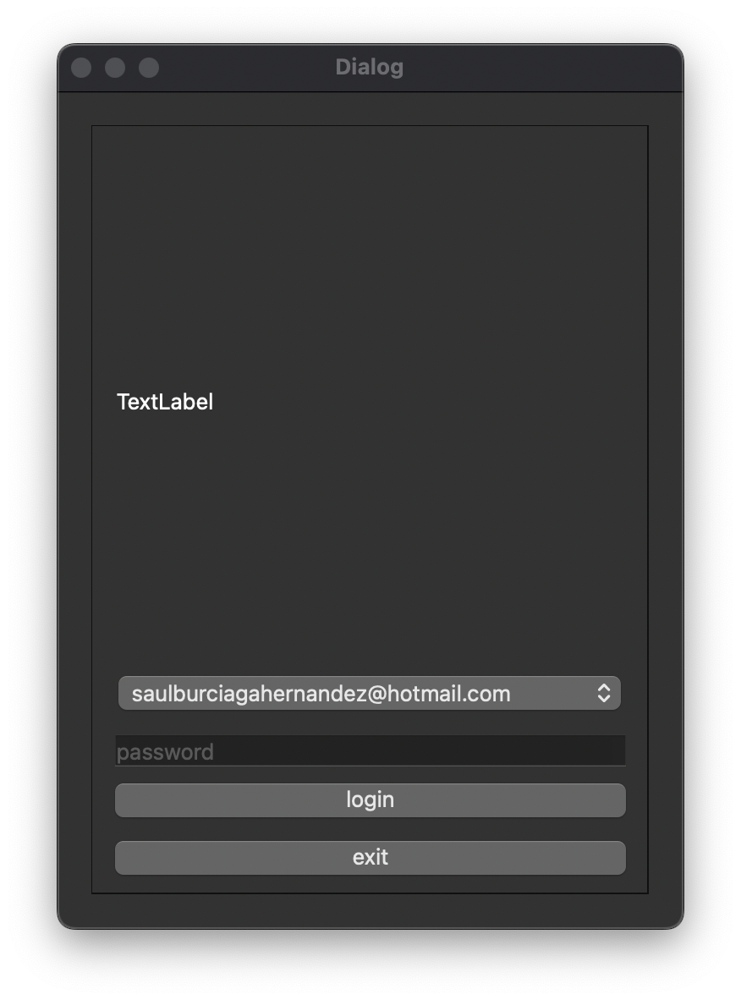

# SirreFacc Sistema Pos
Sistema en beta, no finalizado, tiene como base de datos el servicio firebase realtime database y el uso de pyside 6

# entities 
son los modelos de la base de datos no relacional de firebase, si se desea escalar la base de datos edite estos archivos

# common
en common encontraremos nuestros scripts que nos ayuden en algo en especifico del sitema  por ejemplo el uso de una base de datos. widgets especificos, etc

# modules
es la parte donde se encuentran los modulos del sistema.

<!-- PROJECT LOGO -->
 

  

  

  

  

## Como instalar
1. clonar con el uso de git clone URL
2. montar un entorno virtual con python.
3. insalar los modulos de python los cuales ya se encuentran, en requeriments.txt, los instalamos con el siguiente comando "pip install -r requeriments.txt"

<!-- ABOUT THE PROJECT -->
## Acerca del proyecto
Proyecto basado en las tecnologias de qt, y el lenguaje de programacion python, con el uso de la libreria PySide6. es libre de usarse. el sistema tiene como fin, la ayuda de administrar ventas y un inventario sencillo.